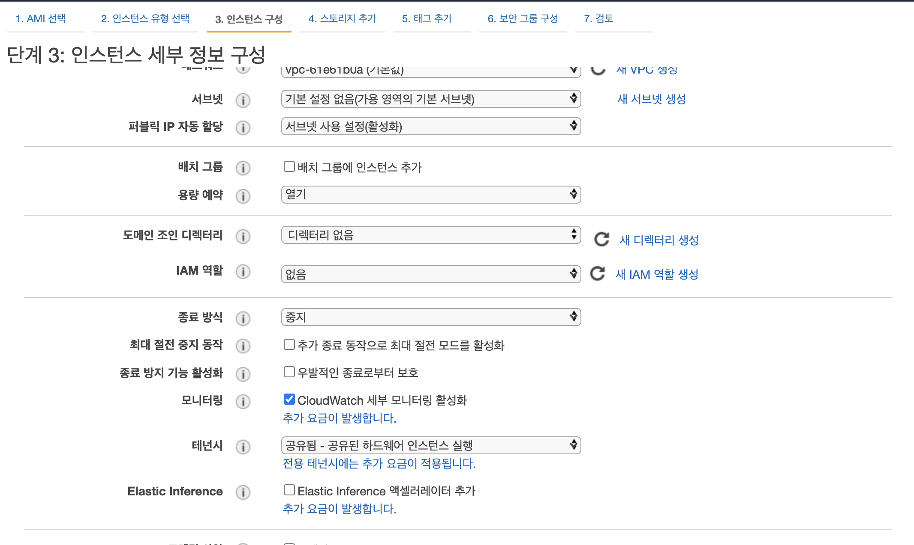
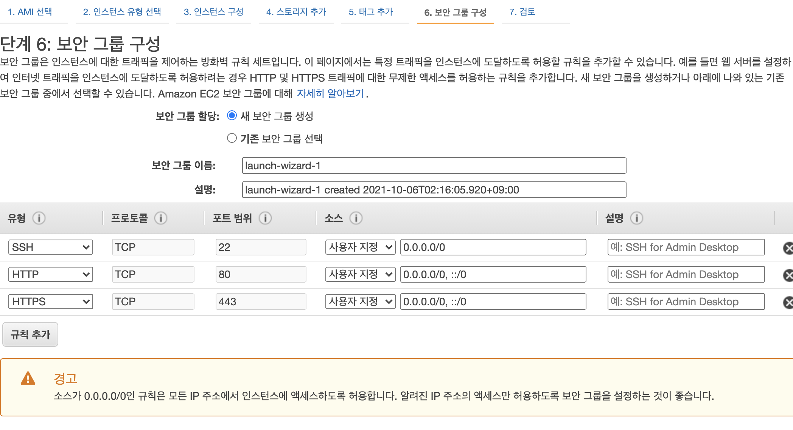
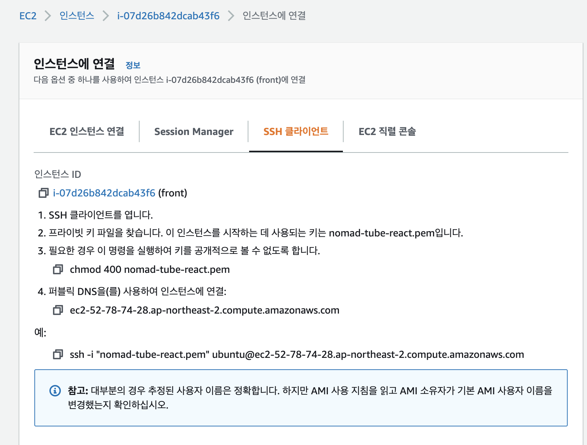

# Front Page Migrate to React


## 일기

- 생각보다 어렵군
- 대충 UI만 바꿔서 만들면 될줄알았음
- 근데 일단 UI만드는거부터 어렵긴했고, 반응형 적용에도 좀 힘들었음(여전히?)
- 가장 힘들었던 부분은 로그인. 
- 이전에는 서버에서 temlplate을 사용했던 경우라 url이 같았음
- 근데 react로 바꾸면서, Front, Server 포트가 달라져서 여러 문제가 생기기 시작
  - cors, credential, session, cookie ...
  - 몇번 공부했던 것들이긴한데 봐도봐도 어렵긴하다
  - 일단, 익숙해지면 되겠지. 잘 알아두자
- 남은 작업은 업데이트(수정작업들)
  - 섬네일
  - 배포

## Front

### 절대경로

- 상대경로 쓰기 귀찮아서 절대경로로 만듬

```json
// jsconfig.json
{
  "compilerOptions": {
    "baseUrl": "src"
  },
  "include": ["src"]
}
```

### box-sizing: border-box;
- width 100% 임에도 오른쪽 여백이 남음
- box-sizing: border-box;로 해결

box-sizing은 박스의 크기를 화면에 표시하는 방식을 변경하는 속성입니다. width와 height는 엘리먼트의 컨텐츠의 크기를 지정합니다. 따라서 테두리가 있는 경우에는 테두리의 두께로 인해서 원하는 크기를 찾기가 어렵습니다. box-sizing 속성을 border-box로 지정하면  테두리를 포함한 크기를 지정할 수 있기 때문에 예측하기가 더 쉽습니다. 최근엔 모든 엘리먼트에 이 값을 지정하는 경우가 늘고 있습니다. 

- https://opentutorials.org/course/2418/13405

### footer 고정
- https://stackoverflow.com/questions/39857425/react-page-keep-footer-at-the-bottom-of-the-page

### 아직 CSS가 좀 어럽네
- 리스폰시브..
- Width, Height
- vw, vh, %, rem, em, px

## 이제 서버랑 연결하면됨.

## Backend

### Session

1. secret: Required option. 노출되면 안되는 정보. 

쿠키를 임의로 변조하는것을 방지하기 위한 값 입니다. 이 값을 통하여 세션을 암호화 하여 저장

2. resave: false 권장. session 데이터가 바뀌기 전까지는 session 저장소의 값을 저장하지 않는다. 

true면 session데이터의 변경 유무에 상관없이 무조건 session 저장소에 저장한다. 

3. saveUninitialized: 세션이 저장되기 전에 uninitialized 상태로 미리 만들어서 저장할지에 대한 것. true 권장. true면 session이 필요하기 전까지는 session을 구동시키지 않는다. 

- https://libertegrace.tistory.com/entry/4-Login-Logout-%EA%B5%AC%ED%98%84%ED%95%98%EA%B8%B0-express-session-middleware-%EC%82%AC%EC%9A%A9

### Login 

- 이틀째 해결중
- 왜 세션이 설정이 안되는가??
- 로그인에서 req.session.user로 세션을 설정.
- 근데 왜 다른 endpoint에서 확인을 못하는가??

- 일단 passport도입 시작

### cookie, session

- 로그인을 한다고해서 서버와 프론트가 같은 정보를 가지고 있지는 않음
- 그렇다고 로그인 정보를 통으로 넘겨주면 보안에 문제가 생김
- 그래서 cookie를 넘겨주는데, 일종의 접근 키? 같은개념이라고 생각하면 될듯
- 임의로 생성된 쿠키를 넘겨주면, 그 쿠키를 가지고 서버는 어떤 사용자인지 인지함
- 프론트에는 쿠키, 서버에는 세션을 가지고 있음
- 근데 세션에 모든 정보가 들어가있으면, 너무 무거움(정보가 커질경우)
- 그래서 세션에 아이디만들고, 그 아이디를 가지고 디비를 확인

### 도메인이 다를경우

- 와 하루종일 풀었음.
- 서버와 프론트가 쿠키를 공유못함. 어떻게 해결해야 하는가?
- cors: access-control-allow-origin: true
- cookie 역시 전달이 안됨.
- cookie가 전달이 안되면, 서버는 누가 정보를 보내는지 모름
- access-control-allow-credential: true
- credential을 설정해줘야함
- cors의 경우 origin: * 로 되어있다면, 정확한 주소를 써줘야함
- 민감한 정보를 주고받기때문에 정책에서 더 강력한 보안을 요구함

```js
// backend
app.use(cors({
  origin: 'http://localhost:3000', // true로 해도됨,
  credentials: true,
}));
```
```js
// frontend
// axios를 사용할 경우, 최상위 파일에서
axios.default.withCredentials = true;
```

### login 유지

- contextAPI를 통해, 전역적으로 뿌려줌

### Profile Image Change

- 이미지 업데이트에 좀 시간이 걸림
- value를 어떻게 받아야하는지 고민.
- 일단 이미 아바타 이미지가있으면, 기존 이미지를 위에 띄워줌
- 이미지가 없으면 디폴트 이미지를 넣어주는걸로 해결
- 이미지를 넣고 업데이트하면 홈으로 이동

### Change Password

- 비밀번호 변경까지 완료
- 이번엔 괜찮게 넘어감

### Comment

1. 댓글 기능 추가
2. 이미 설정되어있던 코멘트 라우터와 프론트를 연결
3. 코멘트의 주인은 삭제보튼이 보임
4. 삭제 라우터는 새로 만들어서 추가

##  배포

1. 기본적으로 서버는 컴퓨터로 돌린다.
2. 그런데 내가 사용하는 컴퓨터로 할 경우, 컴퓨터가 종료되면 서버가 멈추는 문제가 발생
3. 따라서 24시간 꺼지지 않는 컴퓨터가 필요
4. 그 대안이 바로 EC2

### EC2

1. EC2에서 우분투 인스턴스를 하나 생성
2. 일단 프리티어(내 상황에따라 성능을 바꾸면 됨)
3. 인스턴스 구성에서 모니터링 체크

4. 보안그룹 구성

5. 시작하기를 눌러서 키페어 생성 (공개되면 안됨)
6. 인스턴스를 복제해서 한개를 더 만든다
- 하나는 프론트, 하나는 서버용 컴퓨터
- 오른쪽 클릭 > 이미지 및 템플릿 > 이런방석으로 더 많이 시작
7. 인스턴스를 클릭해서, 연결을 클릭
- ssh로 시작하는 주소가 중요
- .pem 파일이 있는 경로로가서 저 명려어를 실행
```md
<!-- 이 에러가 발생할 수 있음 -->
@@@@@@@@@@@@@@@@@@@@@@@@@@@@@@@@@@@@@@@@@@@@@@@@@@@@@@@@@@@
@         WARNING: UNPROTECTED PRIVATE KEY FILE!          @
@@@@@@@@@@@@@@@@@@@@@@@@@@@@@@@@@@@@@@@@@@@@@@@@@@@@@@@@@@@
Permissions 0644 for 'nomad-tube-react.pem' are too open.
It is required that your private key files are NOT accessible by others.
This private key will be ignored.
Load key "nomad-tube-react.pem": bad permissions
ubuntu@ec2-52-78-74-28.ap-northeast-2.compute.amazonaws.com: Permission denied (publickey).

chmod 600 key-pair-이름.pem //해결책
https://o-live.tistory.com/4
```


### in ubuntu

1. git clone으로 내 코드 가져오기
2. 노드설치
- sudo apt-get update
- sudo apt-get install -y build-essential // 이게있어서 노드 에러가 줄어듬
- sudo apt-get install curl
- curl -sL


### EC2 Frontend

### EC2 Backend

1. git clone으로 코드를 받음
2. node설치
- nvm으로 처음에 설치 > sudo npm, sudo node를 읽지 못하는 오류가 생김
- 그래서 apt-get으로 노드 설치
3. .env를 생성해서 환경변수 설정
4. 설치 후 pm2를 통해 Back환경에서 노드가 계속 돌아가도록 설정
5. Mongodb주소를 atlas로 이동
- 개발모드에선 로컬, 배포모드에서는 atlas로 돌아가도록
- **name: 'MongoServerSelectionError'** 에러가 발생할 수있는데, Atlas에서 Network 설정에 아이피를 입략해줘야함
